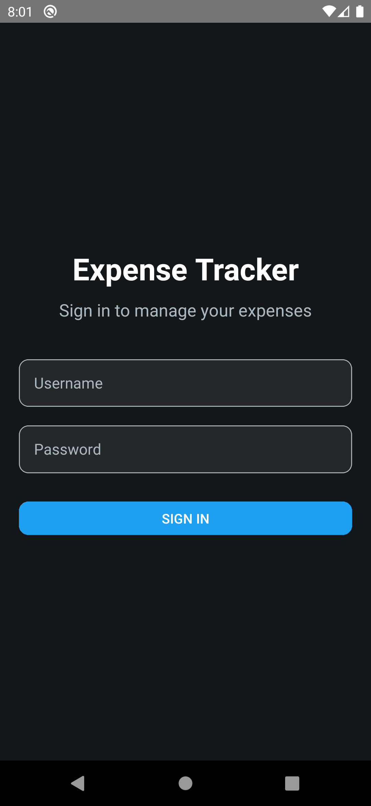

# ExpenseTracker - Financial Management App

ExpenseTracker is a simple financial management app built using React Native. It helps users manage their expenses and track financial transactions. The app provides features like user authentication, transaction management, and detailed transaction views.

---

## How to Run the App

### Prerequisites
- Node.js and npm installed.
- React Native CLI or Expo CLI installed.
- Android/iOS emulator or physical device.

### Steps

1. **Install Dependencies**:
   ```bash
   npm install
   ```

2. **Run the App**:
   
   **For Android:**
   ```bash
   npx react-native run-android
   ```
   
   **For iOS:**
   ```bash
   npx react-native run-ios
   ```

3. **Test the App**:
   - Use the credentials `admin` (username) and `admin` (password) to log in.
   - Explore the Dashboard, add transactions, and view transaction details.

---

## Features

### 1. User Authentication
- **Sign In Screen**: Users can sign in using predefined credentials (username: `admin`, password: `admin`).
- **Logout**: Users can log out from the Dashboard screen, which navigates them back to the Sign In screen.

### 2. Dashboard Screen
- **Transaction List**: Displays a list of all transactions with details like date, amount, description, and category.
- **Transaction Details**: Users can select a transaction to view its full details, including date, amount, description, location, type, and category.
- **Add Transaction**: Users can add a new transaction by providing:
  - **Date**: The date of the transaction.
  - **Amount**: The amount of the transaction (must be a positive number).
  - **Description**: A brief description of the transaction.
  - **Location**: The location where the transaction occurred.
  - **Transaction Type**: Debit, Credit, or Refund.
  - **Category**: Shopping, Travel, or Utility.
- **Validation**: All fields are validated before adding a new transaction.

### 3. Navigation
- **React Navigation**: The app uses React Navigation for seamless navigation between screens.
- **Screen Flow**:
  - **Sign In → Dashboard**: After successful login, users are navigated to the Dashboard.
  - **Dashboard → Transaction Details**: Users can view details of a selected transaction.
  - **Dashboard → Add Transaction**: Users can add a new transaction from the Dashboard.
  - **Dashboard → Sign In**: Users can log out and return to the Sign In screen.

---

## Deliverables

### 1. Project Code
The complete project code is available on GitHub: **ExpenseTracker Repository**.

### 2. Screen Recording
A screen recording demonstrating all functionalities is provided below:

**ExpenseTracker Demo Video** (Replace with actual link to the video).

---

## Screenshots

- **Sign In Screen**  
  

- **Dashboard Screen**  
  

- **Transaction Details Screen**  
  